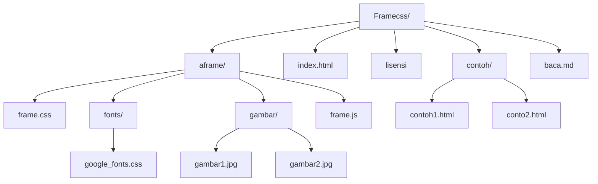

# Frame-CSS
Frame-CSS : _Framework SS Indonesia_
| Nama | Deskripsi |
| --- | --- |
| Versi | 1.1.23 | 
| Lisensi | GNU GPL 3 |

## Daftar isi :

- [Frame-CSS](#frame-css)
- [Daftar isi](#daftar-isi)
- [Ruang Kerja](#ruang-kerja)
- [Diagram](#diagram)
- [Langkah cepat ](#langkah-cepat)
- [info](#info)
- [kontribusi](#kontribusi)
- [HP](#hp)
- [Versi](#versi)
- [Creators](#creators)
- [Thanks](#thanks)
- [lisensi](#lisensi)

# Ruang Kerja Sederhana

  ```text
framecss/
├── aframe/
│   ├── frame.css
│   └── frame.js
├── myweb/
│   └── index.html
├── lisensi
└── readme
  ```
# Ruang Kerja Kompleks
### bundle yang didapat saat unduh
  ```text
framecss/
├── aframe/
│   ├── frame.js
│   ├── animate.css
│   ├── base.css
│   ├── fonts/
│   │   ├── font-awesome.min.css
│   │   ├── googlefonts.css
│   │   └── googlefonts2.woff2
│   ├── frame.css
│   ├── gambar/
│   │   ├── gmb1.jpg
│   │   ├── gmb10.jpg
│   │   ├── gmb11.jpg
│   │   ├── gmb12.jpg
│   │   ├── gmb13.jpg
│   │   ├── gmb14.jpg
│   │   ├── gmb15.jpg
│   │   ├── gmb2.jpg
│   │   ├── gmb3.jpg
│   │   ├── gmb4.jpg
│   │   ├── gmb5.jpg
│   │   ├── gmb6.jpg
│   │   ├── gmb7.jpg
│   │   ├── gmb8.jpg
│   │   └── gmb9.jpg
│   └── normalize.css
├── baca.md
├── contoh/
│   ├── blokkuotes.html
│   ├── gambar.html
│   ├── home.html
│   ├── kontainer.html
│   ├── latar.html
│   ├── login.html
│   ├── navbarbuttonfix.html
│   ├── navbardrop.html
│   ├── navbartopfix.html
│   └── tabel.html
├── lisensi
└── mulai.html
```

## Diagram


# Langkah Cepat
- unduh file FrameCSS [Gdrive](https://google.drive.com) | [Github](https://github.com/nelsenpro/aframe) | [Gitlab](https://)
- buat file index.html
- konfigurasi 
```html
<!DOCTYPE html>

<html lang="en">

<head>

    <meta charset="UTF-8">

    <meta name="viewport" content="width=device-width, initial-scale=1.0">

    <meta http-equiv="X-UA-Compatible" content="ie=edge">

    <title>Document</title>

    <link rel="" href="frame/frame.css" title="css" type="text/css" />

</head>

<body>

    <h1>Selamat Datang di Frame-CSS Indonesia</h1>

</body>

</html>
```

<!-- Text -->
## info
#### sedang dibangun, akan dipublikasikan Maret/April 2023
## kontribusi 
<!-- Text -->
### tentu saja ini bebas dikembangkan
## HP
#### [+6285328736706](https://wa.me/6285328736706)
<!-- Text -->

## Creators
*Nelsen Niko*
<!-- Text -->

## Thanks
[Normalize.css](https://necolas.github.io/normalize.css/) | [Animate.css](https://animate.style/)

