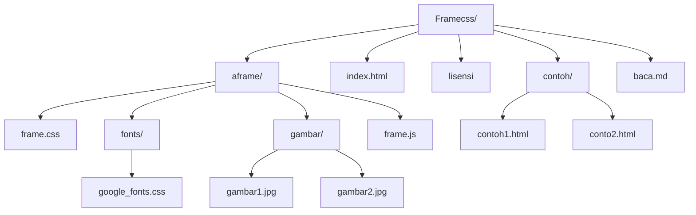

# FrameCSS
Frame _CSS Framework CSS Indonesia_
# Download dan install 
### Terminal, Git, CMD : git clone https://github.com/nelsenpro/frame.git
[Github](https://github.com/nelsenpro/frame.git)
| Nama | Deskripsi |
| --- | --- |
| Versi | 1.1.23 Alpha ; 1.2.23 Alpha| 
| Lisensi | GNU GPL 3 |

## Manfaat Framecss :
1. ukurannya sangat kecil dibandingkan Framework CSS lainnya dan banyak Library CSS yang tidak terpakai
2. cepat dan efisien saat membuat WebApp dan Website
3. gratis dan Open Source
4. mudah digunakan oleh pemula
5. nama-nama kelas "class" kebanyakan pakai bahasa Indonesia
6. Ikon lengkap bawaan dari Fontsawesome versi 5
7. adanya animasi bergerak untuk setiap elemen web
8. hasilnya cukup Responsible, karena mendukung Layout Float dan Grid System

## Kekurangan Framecss:
1. Masih baru muncul February tahun 2023
2. Belum dikenal oleh banyak Web Front-End-Developer
3. Masih banyak Bug, masih versi Alpha( belum ada versi Rilis)
4. Komunitas dan Pengembangnya minim

## Apa yang baru di versi 1.2.23 Alpha?
1. Penambahan Warna-warni milik Bootstrap
2. Memiliki Text Editor
3. Mendukung Grid System Layout
## Daftar isi :

- [Frame-CSS](#frame-css)
- [Daftar isi](#daftar-isi)
- [Ruang Kerja](#ruang-kerja)
- [Diagram](#diagram)
- [Langkah cepat ](#langkah-cepat)
- [info](#info)
- [kontribusi](#kontribusi)
- [HP](#hp)
- [Versi](#versi)
- [Creators](#creators)
- [Thanks](#thanks)
- [lisensi](#lisensi)

# Struktur Framecss 

  ```text
framecss-1.alpha/
├── data/
│   ├── animate.css
│   ├── base.css
│   ├── fonts/
│   │  
│   │   
│   ├── frame.css
│   ├── frame.js
│   ├── gambar/
│   └── normalize.css
├── index.html
├── modif.css
└── modif.js
  ```
# Framecss - Framework CSS Indonesia 
## Ciptakan WebApp dan Website Modern, tanpa batas dan selalu baru.
## Diagram

# Standar template 
```html
<!DOCTYPE html>
<html lang="en">
<head>
    <meta charset="UTF-8">
    <meta name="viewport" content="width=device-width, initial-scale=1.0">
    <meta http-equiv="X-UA-Compatible" content="ie=edge">
            <!-- awal koneksi framecss -->
    <link rel="stylesheet" href="data/frame.css" type="text/css" media="all" />
            <!-- akhir koneksi framecss -->
    <title>Frame-CSS.1.Alpha</title>
</head>
<body>
    <div>
        <!-- bagian navbar-->
        <div class="" id="">
        <!-- akhir navbar-->
        
        <!-- bagian header, jumbotron- blok-->
        </div>
        <div class="">
            <h1 class="">Halo Dunia</h1>
            <p>
                ........
            </p>
        </div>
         <!-- akhir blok, jumbotron-->
         
         <!-- isi konten 1-->
        <div class="baris">
                <div class="utama samping">
                    <h2 class=""></h2>
                    <p></p>
                    <h2 class=""></h2>
                    <p></p>
                </div>
             <!-- akhir konten 1-->
             
             <!-- isi konten 2-->
                <div class="utama tengah">
                    <h2 class=""></h2>
                    <p></p>
                    <h2 class=""></h2>
                    <p></p>
                </div>
             <!-- akhir konten 2-->
             
             <!-- awal footer-->
        </div>
        <div class="kaki">
            <p class=""></p>
        </div>
           <!-- akhir footer-->
    </div>
        <!-- koneksi ke JavaScript-->
    <script src="data/frame.js"></script>
    <script src="modif.js"></script>
          <!-- akhir koneksi JavaScript-->
</body>
</html>
```
# Langkah Cepat
- unduh file FrameCSS [Gdrive](https://google.drive.com) | [Github](https://github.com/nelsenpro/aframe) | [Gitlab](https://)
- buat file index.html
- konfigurasi 
```html
<!DOCTYPE html>

<html lang="en">

<head>

    <meta charset="UTF-8">

    <meta name="viewport" content="width=device-width, initial-scale=1.0">

    <meta http-equiv="X-UA-Compatible" content="ie=edge">

    <title>Document</title>

    <link rel="" href="data/frame.css" title="css" type="text/css" />

</head>

<body>

    <h1>Selamat Datang di Framework CSS Indonesia</h1>

</body>
<script src="data/frame.js"></script>
<script src="modif.js"></script>
</html>
```

<!-- Text -->
## info
#### uji coba dalam versi 1.1.23 Alpha dan 1.2.23 Alpha 
## kontribusi 
<!-- Text -->
### tentu saja ini bebas dikembangkan
## HP
#### [+6285328736706](https://wa.me/6285328736706)
<!-- Text -->

## Creators
*Nelsen Niko*
<!-- Text -->

## Thanks
[Normalize.css](https://necolas.github.io/normalize.css/) | [Animate.css](https://animate.style/)

